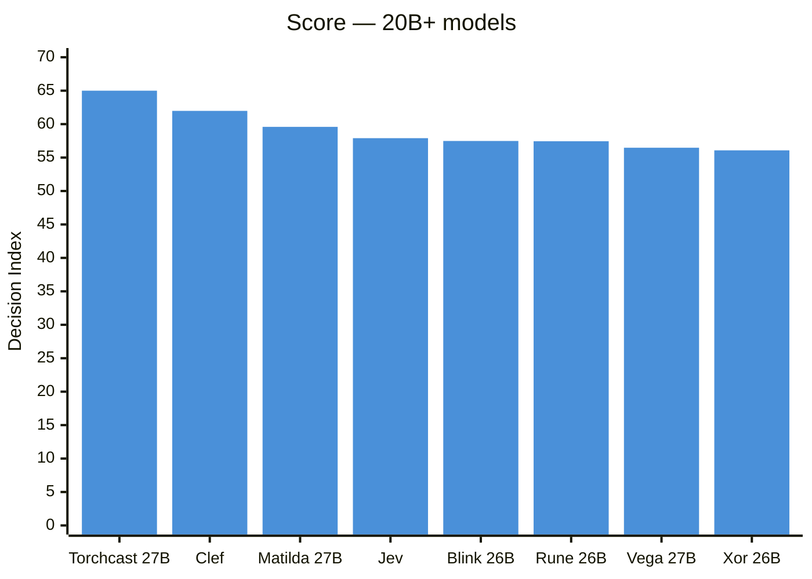
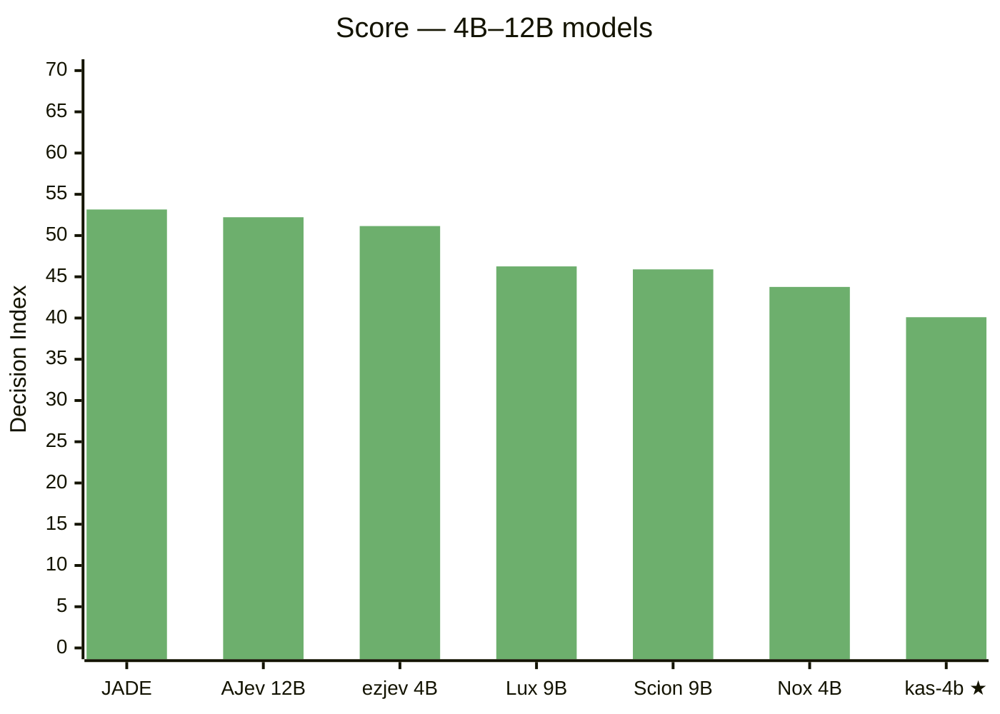
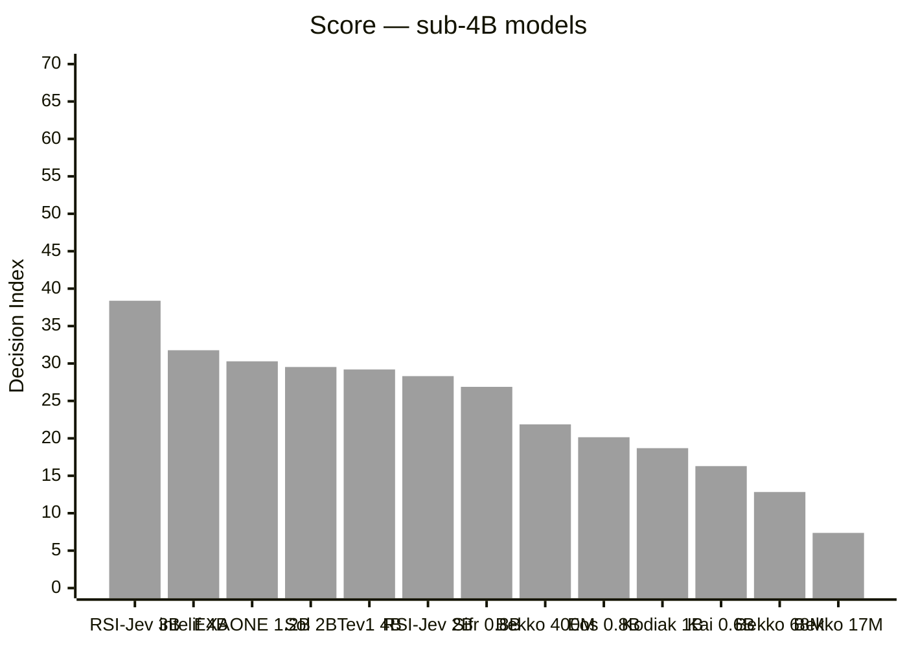

# kas-4b

Decision Index v0.2.1 submission — [kpiya/kas-4b](https://huggingface.co/kpiya/kas-4b)  
Qwen/Qwen3-4B fine-tuned with LoRA · **Score: 40.1**

---

## Decision Index 0.2.1 — Competitive Landscape

Includes models currently on the board and all pending PR submissions as of 2026-10-04.

### Large models (20B+)

### Mid-size models (4B–12B) — kas-4b tier

### Small models (sub-4B)

### Full table

| # | Model | Score | Params | Status |
|---|---|---:|---|---|
| 1 | [Torchcast Decision 27B](https://huggingface.co/torchcast-ai/torchcast-decision-27b) | 65.00 | 27B | PR #58 |
| 2 | [Clef](https://huggingface.co/Cloudflare/clef) | 61.98 | — | PR #54 |
| 3 | [Matilda Jev](https://huggingface.co/Maincode/matilda-jev-v1.3) | 59.59 | 27B | PR #42 |
| 4 | Jev | 57.90 | — | on board |
| 5 | [Blink v0.3 26B-A4B](https://huggingface.co/PixilabAI/Blink-v0.3-26B-A4B-NVFP4) | 57.48 | 26B | PR #47 |
| 6 | Surogate Rune 26B-A4B v3 | 57.44 | 26B | on board |
| 7 | [Decision 2.0 Vega 27B](https://huggingface.co/vllm-sr/Decision-2.0-Vega-27B) | 56.47 | 27B | PR #48 |
| 8 | [Xor 26B-A4B](https://huggingface.co/juspay/Xor-26B-A4B) | 56.08 | 26B | PR #40 |
| 9 | [JADE](https://huggingface.co/theunnecessarythings/JADE) | 53.16 | — | PR #45 |
| 10 | [AJev lora5 12B](https://huggingface.co/andyzhang232/ajev-gemma4-12b-lora5) | 52.22 | 12B | PR #53 |
| 11 | [ezjev-4b-s2](https://huggingface.co/everettjf/ezjev-4b-s2) | 51.15 | 4B | PR #55 |
| 12 | [Decision 2.0 Lux 9B](https://huggingface.co/vllm-sr/Decision-2.0-Lux-9B) | 46.26 | 9B | PR #48 |
| 13 | Scion v4 | 45.90 | 9B | on board |
| 14 | [Decision 2.0 Nox 4B](https://huggingface.co/vllm-sr/Decision-2.0-Nox-4B) | 43.77 | 4B | PR #48 |
| **15** | **[kas-4b ★](https://huggingface.co/kpiya/kas-4b)** | **40.10** | **4B** | **PR #59** |
| 16 | [RSI-Jev v5.0-VL 3B](https://huggingface.co/shgao/rsi-jev-v5.0-vl-3b) | 38.38 | 3B | PR #51 |
| 17 | [intelif-qwen3-4b](https://huggingface.co/UserMoonlight/intelif-qwen3-4b) | 31.77 | 4B | PR #46 |
| 18 | [EXAONE-4.0-1.2B-JEV v0.3](https://huggingface.co/carrtesy/exaone-jev-1.2b-v0.3) | 30.29 | 1.2B | PR #43 |
| 19 | [Decision 2.0 Sol 2B](https://huggingface.co/vllm-sr/Decision-2.0-Sol-2B) | 29.53 | 2B | PR #48 |
| 20 | Tev1-4B | 29.20 | 4B | on board |
| 21 | [RSI-Jev v4.0-VL 2B](https://huggingface.co/shgao/rsi-jev-v4.0-vl-qwen3.5-2b) | 28.31 | 2B | PR #44 |
| 22 | [Sifr 0.8B v3.1](https://huggingface.co/mohamedlotfy50/sifr-0.8b-v3.1) | 26.88 | 0.8B | PR #41 |
| 23 | [Bekko 400M](https://huggingface.co/hotchpotch/bekko-system-one-v0-400m) | 21.87 | 400M | PR #56 |
| 24 | [Decision 2.0 Eos 0.8B](https://huggingface.co/vllm-sr/Decision-2.0-Eos-0.8B) | 20.15 | 0.8B | PR #48 |
| 25 | [Kodiak-v0.2-1B](https://huggingface.co/cortex-agent-llc/kodiak-v0.2-1b-accuracy) | 18.69 | 1B | PR #49 |
| 26 | [Decision 2.0 Kai 0.6B](https://huggingface.co/vllm-sr/Decision-2.0-Kai-0.6B) | 16.29 | 0.6B | PR #48 |
| 27 | [Bekko 68M](https://huggingface.co/hotchpotch/bekko-system-one-v0-68m) | 12.83 | 68M | PR #56 |
| 28 | [Bekko 17M](https://huggingface.co/hotchpotch/bekko-system-one-v0-17m) | 7.37 | 17M | PR #56 |

*Snapshot: 2026-10-04. Pending PRs not yet merged by maintainer.*

---

## kas-4b Details

| | |
|---|---|
| Base model | [Qwen/Qwen3-4B](https://huggingface.co/Qwen/Qwen3-4B) |
| Method | LoRA r64/α128, 2 epochs, LR 1e-4, bs16, 4096 tok |
| Recipe | Inspired by [Scion](https://github.com/sinanuozdemir/ai-experiments/tree/main/experiments/scion) |
| Score | 40.1 (raw 54.18) |
| Latency | 39.2ms median, 546ms p95 |
| Hardware | RTX PRO 6000 Blackwell (HF Jobs) |

**Per-area:** Tools 49.0 · Retrieval 40.4 · Knowledge 39.5 · Arts 37.7 · Language 35.2

Model: [kpiya/kas-4b](https://huggingface.co/kpiya/kas-4b) · Results: [kpiya/decision-index-results](https://huggingface.co/datasets/kpiya/decision-index-results/tree/main/runs/kas-4b)
